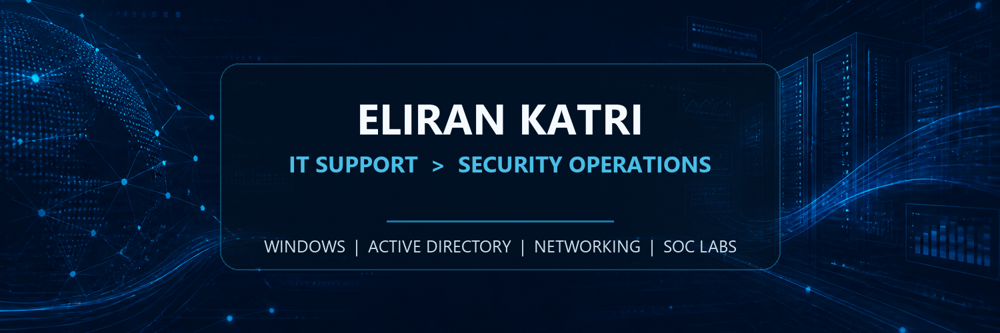
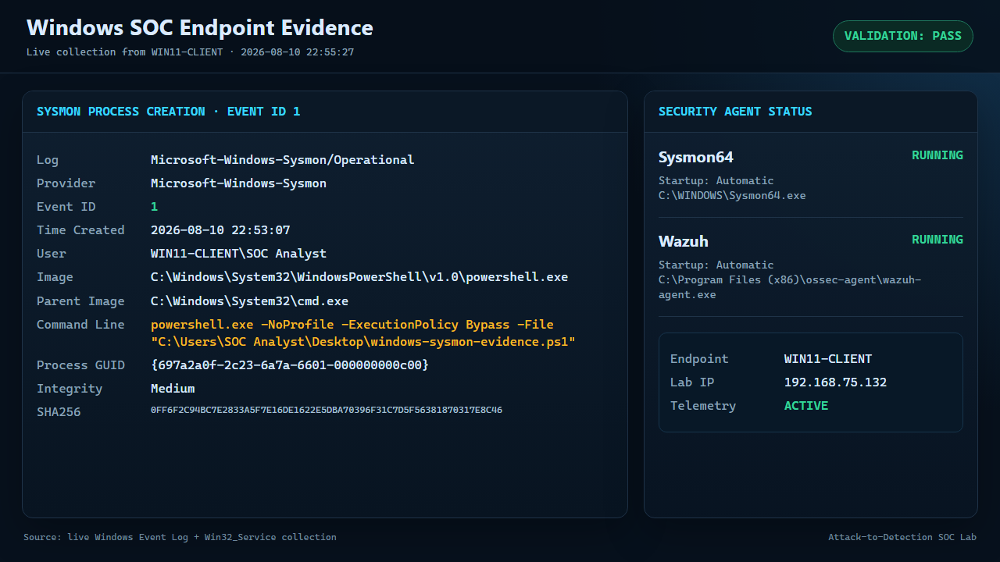
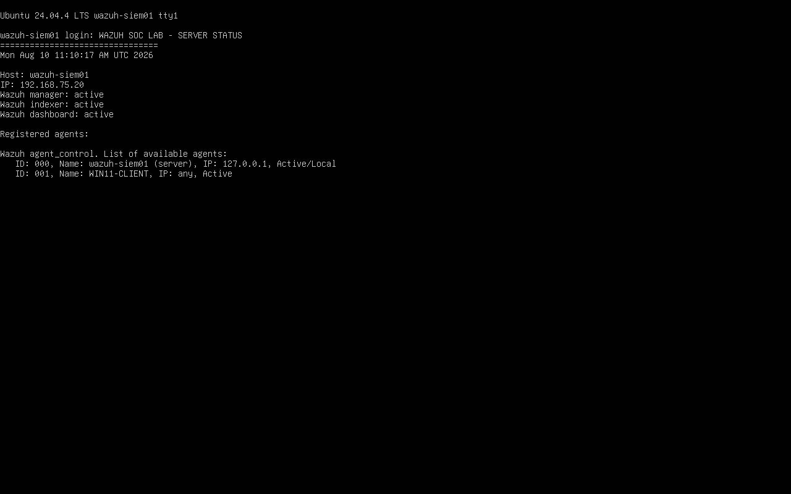

<p align="center">
  
</p>

<p align="center">
  <strong>Enterprise IT experience. Structured cybersecurity training. Evidence-backed SOC projects.</strong>
</p>

<p align="center">
  
  
  
  
</p>

## About me

I am an IT Support Specialist working in a financial enterprise environment, where I handle technical incidents involving Windows, Microsoft 365, Active Directory, networking, remote access, and ServiceNow.

I completed a two-year cybersecurity and information security program. I am converting that foundation into demonstrable SOC experience through an isolated VMware lab, documented detections, sanitized evidence, and incident reports that explain the full path from telemetry to analyst conclusion.

## Featured SOC projects

### [Attack-to-Detection Wazuh Lab](https://github.com/Eliran1991-sudo/Attack-to-Detection-Wazuh-Lab)

End-to-end purple-team workflow connecting controlled Kali reconnaissance, Windows 11 Sysmon telemetry, Wazuh detection engineering, MITRE ATT&CK mapping, and evidence-based incident triage.

- Built and validated custom Wazuh rule `100100` at alert level `10`.
- Captured Sysmon Event IDs `1`, `3`, and `11` from a safe PowerShell simulation.
- Mapped the detection to MITRE ATT&CK `T1059.001`.
- Preserved sanitized evidence and wrote a reproducible incident report.



### [Wazuh SOC Lab](https://github.com/Eliran1991-sudo/SOC-Lab-Portfolio)

Foundational SIEM project covering Wazuh deployment, Windows endpoint onboarding, Event ID `4625` alert validation, analyst triage, and false-positive context in an isolated network.



## Practical foundation

| Area | Current experience |
|---|---|
| Incident workflow | Ticket ownership, prioritization, documentation, escalation, and user communication |
| Windows ecosystem | Windows 11, Windows Server, Microsoft 365, Outlook, and endpoint troubleshooting |
| Identity | Active Directory users, groups, permissions, authentication, and access issues |
| Networking | TCP/IP, DNS, DHCP, VPN, remote connectivity, and network troubleshooting |
| Enterprise tools | ServiceNow, remote-support platforms, VMware, and diagnostic utilities |

## Home lab architecture

```text
VMware Workstation
   │
   └── VMnet1 - isolated 192.168.75.0/24 laboratory network
       ├── WAZUH-SIEM01 - Wazuh manager, indexer, dashboard
       ├── WIN11-CLIENT - Wazuh agent and Sysmon telemetry
       ├── KALI01 - authorized reconnaissance source
       ├── SRV-DC01 - Windows Server / Active Directory
       └── PFSENSE01 - firewall laboratory system
```

Every published action is limited to the authorized local lab and documented so the result can be reproduced, investigated, and explained in an interview.

## SOC learning roadmap

- [x] Investigate failed Windows logons and distinguish controlled activity from suspicious behavior
- [x] Collect detailed Windows telemetry and analyze PowerShell activity with Sysmon
- [x] Ingest endpoint logs into Wazuh and validate a custom SIEM detection
- [x] Map observed activity to MITRE ATT&CK
- [x] Publish concise incident reports with evidence, limitations, and response recommendations
- [ ] Analyze packet captures and document network indicators with Wireshark
- [ ] Build a multi-event correlation rule and test alert tuning

## Technologies

<p>
  
  
  
  
  
  
  
  
  
  
  
</p>

## Portfolio standard

Projects will be published only after they are completed and reviewed. Each project will clearly separate:

- scenario and scope
- data sources and evidence
- investigation steps
- findings and limitations
- false-positive considerations
- recommended response

> Accuracy and honest reporting matter more than a long list of tools.

---

<p align="center">
  Open to <strong>Junior SOC Analyst</strong> and entry-level security operations opportunities.
</p>
