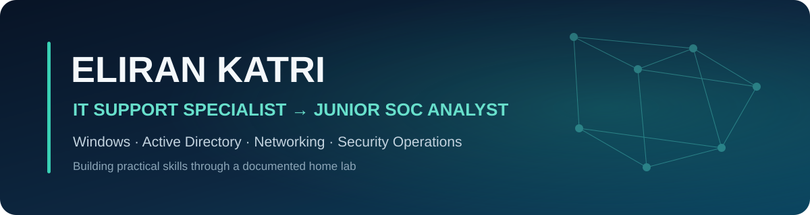

<p align="center">
  
</p>

<p align="center">
  <strong>Enterprise IT experience. Structured cybersecurity training. Practical SOC skills in progress.</strong>
</p>

<p align="center">
  
  
  
</p>

## About me

I am an IT Support Specialist working in a financial enterprise environment, where I handle technical incidents involving Windows, Microsoft 365, Active Directory, networking, remote access, and ServiceNow.

I completed a two-year cybersecurity and information security program. I am now converting that foundation into current, demonstrable SOC experience by building a structured home lab and documenting each investigation from evidence collection through conclusions and recommended response.

## Practical foundation

| Area | Current experience |
|---|---|
| Incident workflow | Ticket ownership, prioritization, documentation, escalation, and user communication |
| Windows ecosystem | Windows 11, Windows Server, Microsoft 365, Outlook, and endpoint troubleshooting |
| Identity | Active Directory users, groups, permissions, authentication, and access issues |
| Networking | TCP/IP, DNS, DHCP, VPN, remote connectivity, and network troubleshooting |
| Enterprise tools | ServiceNow, remote-support platforms, VMware, and diagnostic utilities |

## Home lab

```text
Internet
   │
VMware NAT
   │
PFSENSE01
   │
 VMnet1 — isolated lab network
   │
SRV-DC01 — Windows Server / Active Directory
```

The environment is being expanded carefully so every future project can be reproduced, investigated, and explained in an interview.

## Current SOC learning roadmap

- [ ] Investigate failed Windows logons and distinguish user error from suspicious behavior
- [ ] Collect detailed Windows telemetry and analyze suspicious PowerShell activity
- [ ] Analyze network traffic and document indicators with Wireshark
- [ ] Ingest endpoint logs into a SIEM and perform basic alert triage
- [ ] Map observed activity to MITRE ATT&CK where relevant
- [ ] Publish concise investigation reports with evidence, limitations, and response recommendations

## Technologies

<p>
  
  
  
  
  
  
  
  
</p>

## Portfolio standard

Projects will be published only after they are completed and reviewed. Each project will clearly separate:

- scenario and scope
- data sources and evidence
- investigation steps
- findings and limitations
- false-positive considerations
- recommended response

> Accuracy and honest reporting matter more than a long list of tools.

---

<p align="center">
  Open to <strong>Junior SOC Analyst</strong> and entry-level security operations opportunities.
</p>